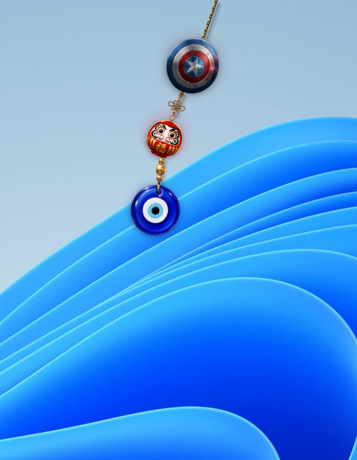
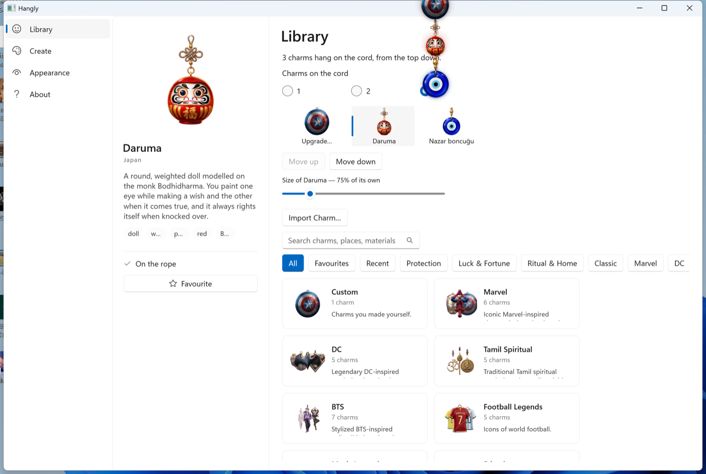

# Hangly for Windows

**A charm hangs from a rope on your desktop.** Push it and it swings, with the weight and
the settle of a real one. That is the whole app.

[](https://github.com/SharanCreatedThis/Hangly-Windows/actions/workflows/build.yml)
[](LICENSE)



A port of [Hangly for macOS](https://www.sharancreatedthis.in/products/hangly), written
in C# on WinUI 3, .NET 9 and Win2D. Windows 10 and 11, x64 and ARM64.

> **Hangly for Windows is in public beta.** It works, it is tested, and it is not signed
> yet — so Windows will warn you the first time you run it. [What to
> expect](TESTER-INSTRUCTIONS.md).

---

## What it does

- **Seventy charms**, in collections — protection, luck, ritual, and a few from stories
  you will recognise. Search them, favourite them, see what you hung recently.
- **Up to three on one cord**, each at its own size, in any order you drag them into.
- **Nine rope styles.** Each one is a different set of solver values rather than a
  different picture, so a gold chain hangs differently from a thread.
- **Real physics.** Twenty segments solved with Verlet integration at a fixed 240 Hz,
  whatever the display is doing. Beads ride the cord as particles in their own right.
- **Make your own.** Drop a PNG, a JPG or an SVG on the charm, or use the **Create** tab,
  and it becomes a charm that hangs like the rest.
- **It stays out of the way.** Click-through everywhere except the charm itself, quiet at
  idle — about 1% of one core — and it asks for no permissions at all.



## Installing

Download from the [latest release](https://github.com/SharanCreatedThis/Hangly-Windows/releases/latest).

| Your PC | Download |
|---|---|
| Most PCs — Intel or AMD | `Hangly-win-x64-Setup.exe` |
| Snapdragon, Surface Pro X and other ARM PCs | `Hangly-win-arm64-Setup.exe` |

Not sure? **Settings → System → About → System type.** If it says "ARM-based processor",
take the ARM64 one; otherwise take x64.

**Windows will warn you.** *"Windows protected your PC"* — click **More info**, then **Run
anyway**. This is not a virus warning; it is what Windows says about any program that has
not been code-signed, and Hangly is not signed yet. Signing is in progress through
[SignPath Foundation](https://signpath.org/), who sign open-source releases at no cost.

It installs for you only, needs no administrator, and lives in
`%LOCALAPPDATA%\Hangly`. It updates itself from this repository's releases.

To remove it: **Settings → Apps → Installed apps → Hangly → Uninstall.**

## Building from source

You need the [.NET 9 SDK](https://dotnet.microsoft.com/download) and Windows 10 1809 or
later. You do **not** need Visual Studio — the Windows App SDK and the XAML compiler come
through NuGet.

```powershell
git clone https://github.com/SharanCreatedThis/Hangly-Windows.git
cd Hangly-Windows

# The solver and models. These run anywhere, including on a Mac.
dotnet test tests/Hangly.Core.Tests/Hangly.Core.Tests.csproj

# The app. Windows only.
dotnet run --project src/Hangly.App/Hangly.App.csproj -c Release -r win-x64 -p:Platform=x64
```

On an ARM machine use `-r win-arm64 -p:Platform=ARM64`.

To build an installer, [`vpk`](https://velopack.io) does it in one step — the exact
command the release workflow runs is in
[`.github/workflows/release.yml`](.github/workflows/release.yml).

One warning for anyone tidying the project file: **`EnableMsixTooling` has to stay.** It
owns PRI generation, the compiled XAML lives inside the PRI, and removing it produces an
app with no XAML at all.

## Reporting a problem

[Open an issue.](https://github.com/SharanCreatedThis/Hangly-Windows/issues/new/choose)

`%APPDATA%\Hangly\hangly.log` holds the last run and is usually the whole answer. It
contains no personal information — [PRIVACY.md](PRIVACY.md) says exactly what is in it.

Hangly runs on hardware its author does not have: every scaling factor except 200%, every
multi-monitor desk, every x64 machine, Windows 10. **A report from one of those is the
most useful thing anybody can send.** [CONTRIBUTING.md](CONTRIBUTING.md) has the rest;
security issues go by email, per [SECURITY.md](SECURITY.md).

## Code signing

Code signing for Hangly for Windows is provided by **[SignPath Foundation](https://signpath.org/)**,
who sign releases for open-source projects at no cost.

**Builds before v1.0 are not yet signed** — the application to the Foundation is in
progress — so Windows currently shows *"Windows protected your PC"* on first run. Once
signing is in place the warning will name the publisher instead, and this section will say
so without the caveat.

## Privacy

Hangly asks for no permissions and has no server and no accounts.

With analytics on it sends a small, fully listed set of events — which charm was hung,
which rope style, that a charm was imported — plus the display name you type when you
first run it. It never sends your Windows account name, your files, your file names, your
location, or anything describing your screen. You can switch it off in **Customize →
About**, and `Hangly.exe --check-analytics` prints exactly what one real event contains.

[PRIVACY.md](PRIVACY.md) is the full account, and it describes this build rather than the
macOS one.

## Roadmap

**v1.0** — what is in the beta, signed, plus the manual QA pass across scaling factors,
multiple monitors and Windows 10.

**v1.1** — Creator Studio, photo import with subject extraction, and sound.

**Not planned.** Weather charms and seasonal charms exist on macOS and are not coming to
Windows. They are removed from the roadmap permanently rather than deferred.

[STATUS.md](STATUS.md) is the detailed picture, [Docs/RELEASE-READINESS.md](Docs/RELEASE-READINESS.md)
carries the numbers, and [PORTING.md](PORTING.md) explains what was rewritten rather than
transcribed, and why.

## How it is put together

```
Hangly.Core          no Windows types anywhere — runs and is tested on any machine
  Geometry/          Vec2, Size, Rect, and the one epsilon the solver compares against
  Physics/           the Verlet solver, the cord curve, the bead pass, the charm layout
  Models/            rope styles, time-of-day profiles, palettes, charm metrics
  Settings/          the settings document and its one write path

Hangly.App           the Windows head
  Overlay/           the transparent click-through window, the clock, the Win2D renderer
  Tray/              the notification-area icon, which is this port's menu bar
  Interop/           the Win32 surface the overlay needs, and nothing else
  Import/            turning a picture or an SVG into a charm
  Customize/         the Library, Create, Appearance and About window
  Services/          displays, launch-at-login, updates, diagnostics
```

Dependencies point inward. `Hangly.Core` knows nothing about WinUI, Win2D or Win32, which
is what lets "the rope never stretches beyond 1.02× its rest length" be a number in a test
rather than an opinion about a screenshot.

The macOS original's physics documentation describes the solver, and this port follows it
to the number — the test suite here is the Swift suite's assertions with the same
tolerances, so any drift shows up as a failing test rather than as a rope that feels
slightly wrong. The parts of that original needed to check the port against are in
`reference/swift/`, read-only; `NOTICE.md` explains what they are.

## Licence

[MIT](LICENSE) for the code.

The charm artwork, the branding and the Hangly name are not MIT — see
[NOTICE.md](NOTICE.md). Build it, fork it, change it; please do not ship the artwork as
your own.
