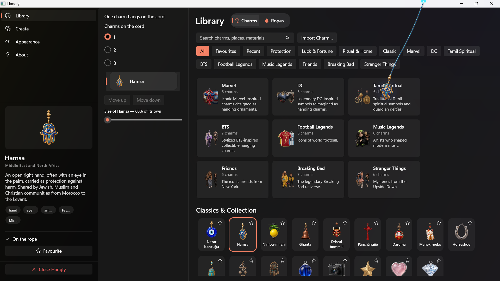

# Hangly for Windows

**A charm hangs from a rope on your desktop.** Push it and it swings, then settles like a
real hanging object.

[](https://github.com/SharanCreatedThis/Hangly-Windows/actions/workflows/build.yml)
[](LICENSE)


Hangly for Windows is a C# application built with WinUI 3, .NET 9 and Win2D. It runs on
Windows 10 and 11, with native x64 and ARM64 builds.

## Features

- 70 charms across protection, luck, ritual, classic and pop-culture collections.
- Up to three charms on one cord, each with its own size and position.
- Nine rope styles with real-time Verlet physics.
- Library search, favourites, recent charms and collection filters.
- Import your own PNG, JPG or SVG charm, or create one in the app.
- Transparent, click-through desktop overlay with low idle CPU usage.



## v1.0.0 release

The current release is **v1.0.0**, available for both supported Windows architectures:

| PC architecture | Installer |
|---|---|
| Intel or AMD | `Hangly-win-x64-Setup.exe` |
| Snapdragon, Surface Pro X and other ARM PCs | `Hangly-win-arm64-Setup.exe` |

Download the latest files from the [GitHub release page](https://github.com/SharanCreatedThis/Hangly-Windows/releases/latest).
Choose ARM64 only when Windows reports an ARM-based processor in **Settings > System > About**.

The installer does not require administrator access. To uninstall, use **Settings > Apps >
Installed apps > Hangly > Uninstall**.

## Build from source

Requirements: [.NET 9 SDK](https://dotnet.microsoft.com/download) and Windows 10 version
1809 or later. The core tests can run on any operating system; the app itself is Windows-only.

```powershell
git clone https://github.com/SharanCreatedThis/Hangly-Windows.git
cd Hangly-Windows

dotnet test tests/Hangly.Core.Tests/Hangly.Core.Tests.csproj
dotnet run --project src/Hangly.App/Hangly.App.csproj -c Release -r win-x64 -p:Platform=x64
```

For ARM64, use `-r win-arm64 -p:Platform=ARM64`.

## Support

[Open an issue](https://github.com/SharanCreatedThis/Hangly-Windows/issues/new/choose) for
bugs or questions. When reporting a problem, include the relevant details from
`%APPDATA%\Hangly\hangly.log`.

See [CONTRIBUTING.md](Reference/CONTRIBUTING.md) for development guidance and
[SECURITY.md](Reference/SECURITY.md) for security reports.

## Privacy

Hangly has no accounts or server. Analytics is optional and can be disabled in
**Customize > About**. When enabled, it sends only the documented app events and the display
name entered during first run. It does not send account names, files, file names, location or
screen content.

Read the complete [privacy policy](Reference/PRIVACY.md).

## License

The code is available under the [MIT License](LICENSE). The charm artwork, branding and
Hangly name are not MIT-licensed; see [NOTICE.md](Reference/NOTICE.md).