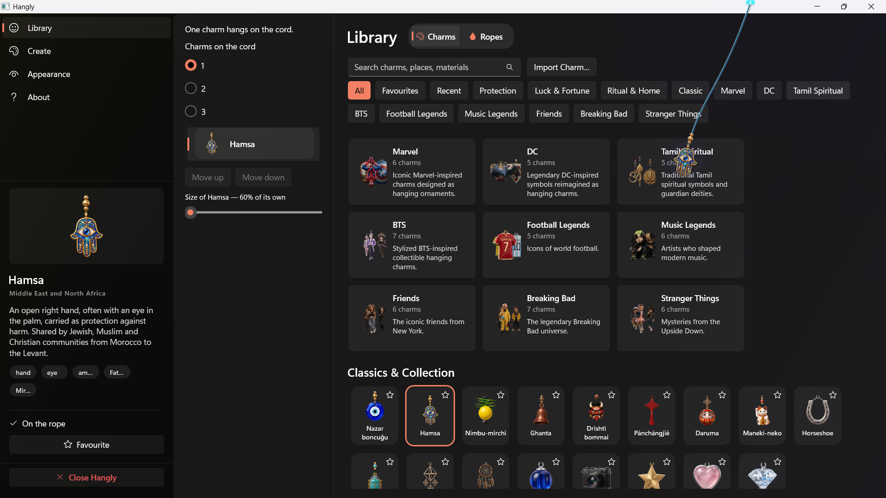

<div align="center">

  

  <p>Minimalist interactive physics charm for Windows and Android.</p>

  [](https://github.com/SharanCreatedThis/Hangly-Windows/actions)
  [](LICENSE)

  <br/>
  
  

</div>

<br/>

###  Overview

Hangly is a physics-based interactive charm that hangs beautifully on your screen. Give it a push, and it swings with real-time Verlet physics before gracefully settling down. Available for both **Windows** (WinUI 3 & .NET 9) and **Android** (Flutter).

###  Features

* **Physics Engine:** Real-time interactive swinging mechanics.
* **Extensive Library:** Choose from over 70 unique charms across various collections.
* **Customization:** Multiple rope styles, sizes, and position configurations.
* **Personal Charms:** Import your own PNG, JPG, or SVG designs.
* **Unobtrusive:** Transparent, click-through overlay with extremely low background CPU usage.

<br/>

<div align="center">
  
</div>

<br/>

###  Downloads

Grab the latest automated installer files from the [Releases Page](https://github.com/SharanCreatedThis/Hangly-Windows/releases/latest). The current stable release is **v2.1.1**.

| Platform | Architecture | Binary |
| :--- | :--- | :--- |
| **Windows** | x64 (Intel/AMD) | `Hangly-win-x64-Setup.exe` |
| **Windows** | ARM64 (Snapdragon) | `Hangly-win-arm64-Setup.exe` |
| **Android** | Universal | `CharmHangly-Mobile.apk` (Upcoming) |

###  Building from Source

To compile the projects locally, you can use our built-in python script which elegantly handles both the C# desktop application and the Flutter mobile app.

**Prerequisites:**
* Python 3.8+
* .NET 9 SDK (For Windows Desktop)
* Flutter SDK (For Android)

```bash
git clone https://github.com/SharanCreatedThis/Hangly-Windows.git
cd Hangly-Windows

python builder.py
```

Follow the interactive prompt to build the `x64`, `arm64`, `windows`, or `mobile` architectures.

###  Privacy & License

Hangly runs entirely offline. Optional analytics can be disabled in the settings. Released under the [MIT License](LICENSE). Please review [NOTICE.md](Reference/NOTICE.md) for specifics regarding artwork and branding rights.